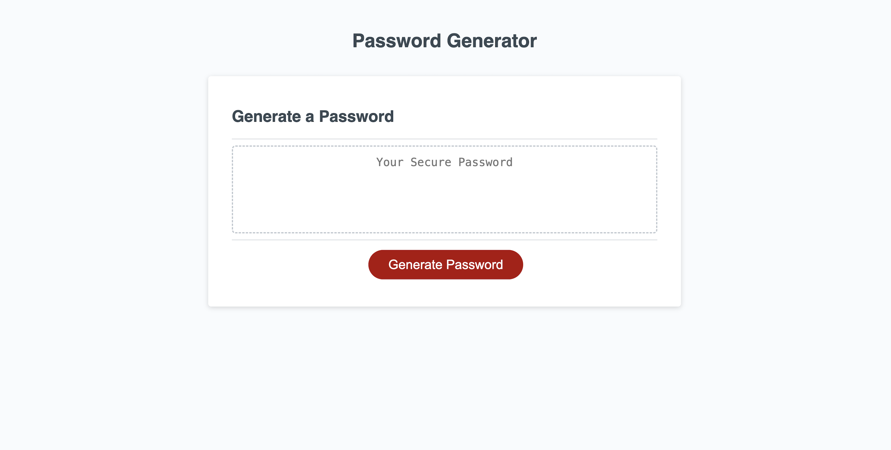
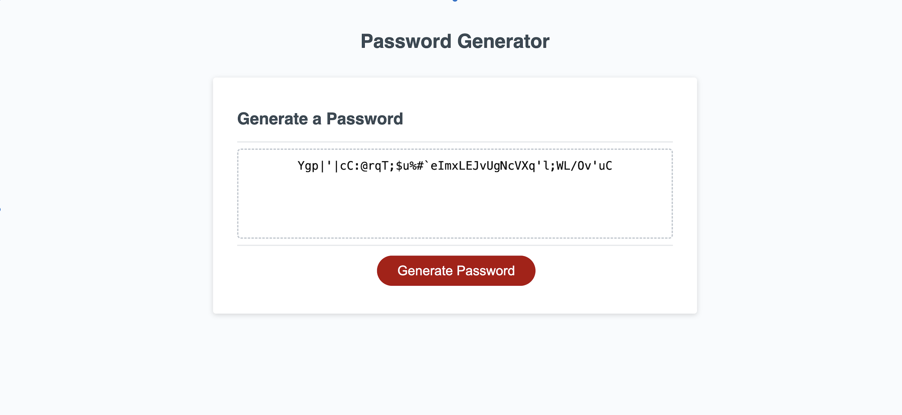

# Title

The Random Password Generator 

## Description

This project's goal is to generate an randomised password for the user based on their choice of characters. 

The motivation for this project originated from my own experiences of wanting to use different passwords for my various accounts without having to think of my own. 

Using this application enables the user to generate a unique password in seconds. This not only saves effort, energy but most of all time. 
Create random unique passwords easily with this application!

## Installation

This web-application is easy to use on any device and at anytime. 

Simply navigate to - https://eddiespag-hetti.github.io/Password_Gen_Project/

## Usage

Web application as it appears in a browser - 

   

    

## Credits

N/A

## License

Please see License associated with this Github Repository.

## Features 

Folow the prompts to generate a unique password in seconds. Enter your choices of characters and generate your password in the empty field.

